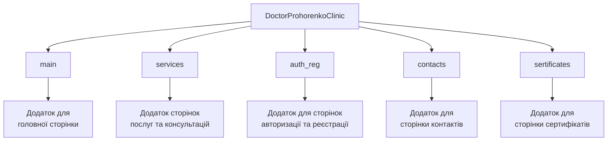
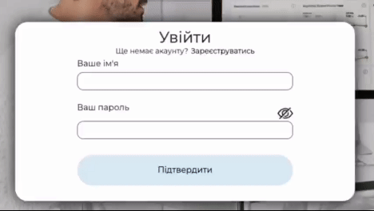

# Doctor Prohorenko Clinic

Цей проект є сайтом для доктора Прохоренко. На цьому сайті ви можете ознайомитись з інформацією про доктора та клініку, та як з нею зв'язатись. Ви можете продивитись наявні послуги й консультації, та їх ціни. Сайт має зручний дизайн та функціонал, тому ви маєте змогу швидко отримати потрібну вам інформацію, та записатись на прийом.

## Зміст
- [Встановлення](#встановлення)
- [Учасники команди](#учасники-команди)
- [Опис сторінок проекту](#опис-сторінок-проекту)
- [Використані технології](#використані-технології)
- [Посилання на Figma та FigJam](#посилання-на-figma-та-figjam)
- [Структура проекту](#структура-проекту)
- [Функціонал проекту](#функціонал-проекту)
- [Моделі проекту](#моделі-проекту)

## Встановлення
1. Клонування репозиторію
```
git clone https://github.com/FeliksNovoselskyi/pre-diploma-practice-2024.git
```
2. Перехід до головної директорії проекту з файлом ```manage.py```
```
cd DoctorProhorenkoClinic
```
3. Запуск локального серверу
```
python manage.py runserver
```

## Учасники команди
- [Новосельський Фелікс/Novoselskyi Feliks](https://github.com/FeliksNovoselskyi) - лідер команди
- [Гераймович Семен/Heraimovych Semen](https://github.com/arman455) - дизайнер проекту, та його розробник
- [Людмила Махиня/Makhynia Liudmyla](https://github.com/LiudmylaMakhynia) - дизайнер проекту, та його розробник
- [Михненко Данило/Mykhnenko Danylo](https://github.com/danil-michnenko) - дизайнер проекту, та його розробник

## Опис сторінок проекту
- **Головна сторінка** - можливість швидко переглянути наявні пропозиції клініки.
- **Сторінки послуг та консультацій** - сторінки, на яких ви зможете зручно переглянути наявні послуги та консультації, з наявними до них цінами. А також записатись на прийом.
- **Сторінка сертифікатів** - на цій сторінці ви можете продивитись сертифікати лікаря.
- **Сторінка контактів** - на цій сторінці ви можете переглянути основну інформацію клініки, де вона знаходиться, її соцмережі, номер телефону, та пошту для зв'язку.
- **Сторінка авторизації та реєстрації** - на цих сторінках ви можете створити свій акаунт на сайті, та увійти в нього.

## Використані технології
- **[Python](https://docs.python.org/3/)/[Django](https://docs.djangoproject.com/en/5.0/)** - мова програмування та основний веб-фреймворк, які забезпечують роботу сайту.
- **[Bootstrap 5](https://getbootstrap.com/)** - фронтенд-фреймворк, допомагає у створенні фронтенд частини сайту.
- **[HTML](https://developer.mozilla.org/en-US/docs/Web/HTML) та [CSS](https://developer.mozilla.org/en-US/docs/Learn/Getting_started_with_the_web/CSS_basics)** - використовуються для створення основної фронтенд частини сайту.
- **[JavaScript](https://developer.mozilla.org/en-US/docs/Web/JavaScript)** - робить контент сайту динамічним, та покращує використання сайту користувачем.
- **[SQLite3](https://docs.python.org/3/library/sqlite3.html)** - база даних, яка була використана для розробки сайту.
- **[MySQL](https://dev.mysql.com/doc/)** - база даних, яка використовується для забезпечення роботи сайту.
- **[dotenv](https://pypi.org/project/python-dotenv/)** - пакет, використаний для вивантаження змінних з файлу .env.
- **[Figma](https://help.figma.com/hc/en-us)** - онлайн-сервіс, використаний для планування дизайну сайту.
- **[FigJam](https://help.figma.com/hc/en-us/articles/1500004362321-Guide-to-FigJam)** - онлайн-сервіс, який був використаний для планування функціоналу сайту.

## Посилання на Figma та FigJam
- [Figma проект](https://www.figma.com/design/Cmxt8OjIxcQVkusZVgJpJS/Untitled?node-id=0-1&t=IXh6wswWVGBAbsu6-1)
- [FigJam](https://www.figma.com/board/Y5U9mctjukxSB2A5laDTnH/pre-diploma-practice-2024-FIGJAM?t=iRElZM5fwQltrSYK-1)

## Структура проекту


## Функціонал проекту

### Файл DoctorProhorenkoClinic/main/backends/email_backend.py

```python
# Імпортує модуль ssl, який надає доступ до основних функцій і констант, необхідних для створення захищених з'єднань SSL/TLS
import ssl

from django.core.mail.backends.smtp import EmailBackend as SMTPBackend  # Імпортує клас EmailBackend з модуля django.core.mail.backends.smtp і перейменовує його на SMTPBackend для зручності
from django.utils.functional import cached_property  # Імпортує декоратор cached_property з модуля django.utils.functional

# Визначає новий клас EmailBackend, який успадковує всі властивості та методи від SMTPBackend
class EmailBackend(SMTPBackend):
    # Цей декоратор надає можливість кешувати результат обчислення властивості, щоб його обчислювали тільки один раз і потім використовували повторно
    @cached_property
    def ssl_context(self):
        # Перевіряє, чи визначено атрибути ssl_certfile або ssl_keyfile. Ці атрибути вказують на файли сертифіката та ключа для SSL
        if self.ssl_certfile or self.ssl_keyfile:
            ssl_context = ssl.SSLContext(protocol=ssl.PROTOCOL_TLS_CLIENT)  # Якщо вказані файли сертифіката або ключа, створюється новий SSL-контекст з використанням протоколу PROTOCOL_TLS_CLIENT
            ssl_context.load_cert_chain(self.ssl_certfile, self.ssl_keyfile)  # Завантажує сертифікат і ключ в SSL-контекст, використовуючи зазначені файли
            return ssl_context
        else:
            ssl_context = ssl.create_default_context() # Використання стандартного SSL контексту, якщо сертифікат і ключ не задані
            ssl_context.check_hostname = False  # Відключення перевірки імені хоста
            ssl_context.verify_mode = ssl.CERT_NONE  # Відключення перевірки сертифікату
            return ssl_context
```

Таким чином, цей клас розширює стандартний EmailBackend, додаючи підтримку користувацького SSL-контексту для шифрування з'єднань під час надсилання електронної пошти через SMTP.

### Файл DoctorProhorenkoClinic/utils.py

```python
from django.core.mail import send_mail # Імпортуємо функцію send_mail, яку використовуємо для відправки запису на пошту
import DoctorProhorenkoClinic.settings as settings # Імпортуємо налаштування з файлу проекту settings

# Створюємо функцію, яка відправляє запис на пошту
def send_on_email(request):
    # Перевіряємо, чи є метод запиту POST (тобто форма була відправлена)
    if 'enroll_button' in request.POST:
        # Отримуємо з форми для запису введену користувачем інформацію
        username = request.POST.get('username')
        surname = request.POST.get('surname')
        email = request.POST.get('email')
        phone = request.POST.get('phone')
        additionally_info = request.POST.get('additionally-info')

        # Перевіряємо, чи була заповнена форма
        if username and surname and email and phone:
            # Перевіряємо, чи додав користувач коментар
            if additionally_info:
                # Відправляємо запис на пошту менеджеру використовуючи функцію send_mail
                send_mail(subject='enroll',
                        message=f'{username} {surname} має потребу у ваших послугах. Його/Її номер телефону: {phone} \nДодатковий коментар користувача: {additionally_info}',
                        from_email=settings.EMAIL_HOST_USER,
                        recipient_list=['doctorprohorenkoclinic@gmail.com', settings.EMAIL_HOST_USER]
                )
                # Відправляємо запис на пошту користувачу використовуючи функцію send_mail
                send_mail(subject='enroll',
                        message=f'Ви записались на прийом у клініці Доктора Прохоренко. \nВами було заповнено форму, ви ввели до неї: \nІм\'я: {username} \nПрізвище: {surname} \nПошту: {email} \nНомер телефону: {phone} \nДодатковий коментар: {additionally_info}',
                        from_email=settings.EMAIL_HOST_USER,
                        recipient_list=[email]
                )
            else:
                # Відправляємо запис на пошту менеджеру використовуючи функцію send_mail, але без додаткового коментаря
                send_mail(subject='enroll',
                        message=f'{username} {surname} має потребу у ваших послугах. Його/Її номер телефону: {phone} \nДодатковий коментар: не був вказаний',
                        from_email=settings.EMAIL_HOST_USER,
                        recipient_list=['doctorprohorenkoclinic@gmail.com', settings.EMAIL_HOST_USER]
                )
                # Відправляємо запис на пошту користувачу використовуючи функцію send_mail, але без додаткового коментаря
                send_mail(subject='enroll',
                        message=f'Ви записались на прийом у клініці Доктора Прохоренко. \nВами було заповнено форму, ви ввели до неї: \nІм\'я: {username} \nПрізвище: {surname} \nПошту: {email} \nНомер телефону: {phone} \nДодатковий коментар: не був вказаний',
                        from_email=settings.EMAIL_HOST_USER,
                        recipient_list=[email]
                )
```

Отже цей файл забезпечує відправлення записів на пошту, створюючи функцію, яку можна використати у будь-якому файлі проекту.

### Файл DoctorProhorenkoClinic/auth_reg/views.py

#### Функція auth_view:
```python
def auth_view(request):
    context = {}
    
    # Вимкнути відображення footer-а та вимкнути відображення посилання для сторінки входу
    context['show_footer'] = False
    context['show_sign_in'] = False
    
    # Якщо користувач увійшов в акаунт
    if request.user.is_authenticated:
        # Додати ім'я користувача до контексту
        context['username'] = request.user.username
        # Вказати, що користувач увійшов у систему
        context['signed_in'] = True
        # Відобразити кнопку виходу
        context['leave_btn'] = True
    
    # Якщо натиснута кнопка реєстрації
    if 'join_btn' in request.POST:
        # Якщо користувач вже автентифікований
        if request.user.is_authenticated:
            # Додати повідомлення про помилку до контексту
            context['error'] = 'Ви вже зареєстровані'
        else:
            # Отримати ім'я користувача та пароль з POST-запиту
            username = request.POST.get('username')
            password = request.POST.get('password')
            
            # Додати введені дані до контексту
            context["username_input"] = username
            context["password_input"] = password
            
            # Якщо ім'я користувача та пароль заповнені
            if username and password:
                # Спробувати автентифікувати користувача
                user = authenticate(username=username, password=password)
                if user:
                    # Увійти у систему як автентифікований користувач
                    login(request, user)
                    # Перенаправити на головну сторінку
                    return redirect('main_page')
                else:
                    # Додати повідомлення про помилку до контексту
                    context['error'] = "Ім'я або пароль невірні"
            else:
                # Додати повідомлення про помилку до контексту, якщо поля порожні
                context['error'] = 'Заповніть усі поля'
    
    # Якщо натиснута кнопка виходу
    if 'leave_btn' in request.POST:
        # Вийти з системи
        logout(request)
        # Перенаправити на сторінку авторизації
        return redirect('auth_page')
    
    # Відобразити шаблон авторизації з контекстом
    return render(request, 'auth_reg/auth.html', context)
```
Ця функція відповідальна за відображення сторінки авторизації, авторизацію користувача, вхід в його акаунт

#### Функція reg_view:
```python
def reg_view(request):
    # Ініціалізуємо контекст для передачі даних у шаблон
    context = {}
    
    # Вимкнути відображення footer-а та увімкнути відображення посилання для сторінки входу
    context['show_footer'] = False
    context['show_sign_in'] = True
    
    # Якщо користувач увійшов в акаунт
    if request.user.is_authenticated:
        # Додаємо ім'я користувача до контексту
        context['username'] = request.user.username
        # Вказуємо, що користувач увійшов у систему
        context['signed_in'] = True
    
    # Якщо метод запиту POST (тобто форма була відправлена)
    if request.method == 'POST':
        # Отримуємо дані з POST-запиту
        username = request.POST.get('username')
        surname = request.POST.get('surname')
        phone = request.POST.get('phone')
        email = request.POST.get('email')
        password = request.POST.get('password')
        
        # Додаємо введені дані до контексту
        context["username_input"] = username
        context["surname_input"] = surname
        context["phone_input"] = phone
        context["email_input"] = email
        context["password_input"] = password
        
        # Перевіряємо, що всі поля заповнені
        if username and surname and phone and email and password:
            # Перевіряємо, що довжина пароля не менше 8 символів
            if len(password) >= 8:
                try:
                    # Створюємо нового користувача
                    User.objects.create_user(
                        username=username,
                        last_name=surname,
                        email=email,
                        password=password,
                    )
                    # Перенаправляємо на сторінку авторизації
                    return redirect('auth_page')
                except IntegrityError:
                    # Якщо користувач з таким ім'ям вже існує, додаємо повідомлення про помилку до контексту
                    context['error'] = 'Такий користувач вже існує'
            else:
                # Якщо пароль занадто короткий, додаємо повідомлення про помилку до контексту
                context['error'] = 'Пароль занадто малий'
        else:
            # Якщо не всі поля заповнені, додаємо повідомлення про помилку до контексту
            context['error'] = 'Заповніть усі поля'
    
    # Відображаємо шаблон реєстрації з контекстом
    return render(request, 'auth_reg/reg.html', context)
```
Ця функція відповідальна за відображення сторінки реєстрації, реєстрацію користувача, створення його акаунту

### Файл DoctorProhorenkoClinic/main/views.py

#### Функція main_view:
```python
def main_view(request):
    # Ініціалізуємо контекст для передачі даних у шаблон
    context = {}

    # Увімкнути відображення footer-а та увімкнути відображення посилання для сторінки входу
    context['show_footer'] = True
    context['show_sign_in'] = True

    # Якщо користувач увійшов в акаунт
    if request.user.is_authenticated:
        # Додати ім'я користувача до контексту
        context['username'] = request.user.username
        # Вказуємо, що користувач увійшов у систему
        context['signed_in'] = True

    # Визиваємо функцію, яка виконує відправку запису на пошту
    utils.send_on_email(request)

    # Відображаємо шаблон головної сторінки з контекстом
    return render(request, 'main/main.html', context)
```
Ця функція відображає головну сторінку та задає їй налаштування за допомогою контексту

### Файл DoctorProhorenkoClinic/services/views.py

#### Функція services_first_view:
```python
def service_first_view(request):
    # Ініціалізуємо контекст для передачі даних у шаблон
    context = {}

    # Передаємо у змінну all_service1 усі послуги з відповідної моделі, для відображення їх на сторінці
    all_service1 = Service1.objects.all()

    # Передаємо у контекст отримані послуги з моделі
    context["all_service1"] = all_service1

    # Увімкнути відображення footer-а та увімкнути відображення посилання для сторінки входу
    context['show_footer'] = True
    context['show_sign_in'] = True

    # Якщо користувач увійшов в акаунт
    if request.user.is_authenticated:
        # Додати ім'я користувача до контексту
        context['username'] = request.user.username
        # Вказуємо, що користувач увійшов у систему
        context['signed_in'] = True

    # Визиваємо функцію, яка виконує відправку запису на пошту
    utils.send_on_email(request)

    # Відображаємо шаблон першої сторінки послуг з контекстом
    return render(request, 'services/service_first.html', context)
```
Ця функція відображає першу сторінку послуг та задає їй налаштування за допомогою контексту

Далі у цьому файлі йдуть ще три схожих на цю функції для інших сторінок с послугами, та сторінки консультацій:
- service_second_view - використовує модель Service2
- service_third_view - використовує модель Service3
- service_consultations_view - використовує модель Consultations

### Файл DoctorProhorenkoClinic/contacts/views.py

#### Функція contacts_view:
```python
def contacts_view(request):
    # Ініціалізуємо контекст для передачі даних у шаблон
    context = {}

    # Вимкнути відображення footer-а та увімкнути відображення посилання для сторінки входу
    context['show_footer'] = False
    context['show_sign_in'] = True

    # Якщо користувач увійшов в акаунт
    if request.user.is_authenticated:
        # Додати ім'я користувача до контексту
        context['username'] = request.user.username
        # Вказуємо, що користувач увійшов у систему
        context['signed_in'] = True

    # Визиваємо функцію, яка виконує відправку запису на пошту
    utils.send_on_email(request)

    # Відображаємо шаблон сторінки контактів з контекстом
    return render(request, 'contacts/contacts.html', context)
```
Ця функція відображає сторінку контактів, задає їй налаштування за допомогою контексту

### Файл DoctorProhorenkoClinic/sertificates/views.py

#### Функція sertificates_view:
```python
def sertificates_view(request):
    # Ініціалізуємо контекст для передачі даних у шаблон
    context = {}

    # Увімкнути відображення footer-а та увімкнути відображення посилання для сторінки входу
    context['show_footer'] = True
    context['show_sign_in'] = True

    # Якщо користувач увійшов в акаунт
    if request.user.is_authenticated:
        # Додати ім'я користувача до контексту
        context['username'] = request.user.username
        # Вказуємо, що користувач увійшов у систему
        context['signed_in'] = True

    # Визиваємо функцію, яка виконує відправку запису на пошту
    utils.send_on_email(request)

    # Відображаємо шаблон сторінки сертифікатів з контекстом
    return render(request, 'sertificates/sertificates.html', context)
```
Ця функція відображає сторінку сертифікатів, задає їй налаштування за допомогою контексту

### Файл DoctorProhorenkoClinic/main/static/main/js/base.js


```javascript
// Отримуємо посилання на послуги в шапці та footer
const sLink = document.querySelector('#service-link')
const sMenu = document.querySelector('.services-menu')

// Отримуємо меню послуг в шапці та footer
const sLinkFooter = document.querySelector('#service-link-footer')
const sMenuFooter = document.querySelector('.services-menu-footer')

// Обробник події кліку на посилання послуги в шапці
sLink.addEventListener('click', () => {
    const linkObj = sLink.getBoundingClientRect()
    
    // Перемикаємо клас для показу або приховування меню в шапці
    sMenu.classList.toggle('show-s-menu')
    sMenu.style.top = linkObj.bottom + 'px'
    sMenu.style.left = linkObj.left + 'px'
});

// Обробник події кліку на посилання послуги в footer
sLinkFooter.addEventListener('click', () => {
    const linkObjFooter = sLinkFooter.getBoundingClientRect()
    
    // Перемикаємо клас для показу або приховування меню в footer
    sMenuFooter.classList.toggle('show-s-menu-footer')
    sMenuFooter.style.top = (linkObjFooter.bottom + window.scrollY) + 'px';
    sMenuFooter.style.left = (linkObjFooter.left + window.scrollX) + 'px';
});

// Обробник події кліку поза меню в шапці, при якому воно зникає
document.addEventListener('click', (event) => {
    // Умова, якщо клік був поза меню, воно зникає
    if (!sLink.contains(event.target) && !sMenu.contains(event.target)) {
        sMenu.classList.remove('show-s-menu')
    }
})

// Обробник події кліку поза меню в footer, при якому воно зникає
document.addEventListener('click', (event) => {
    // Умова, якщо клік був поза меню, воно зникає
    if (!sLinkFooter.contains(event.target) && !sMenuFooter.contains(event.target)) {
        sMenuFooter.classList.remove('show-s-menu-footer')
    }
})
```
Отже, у цьому файлі виконується відкривання та закривання меню з послугами та консультаціями
Ці файли забезпечують розгортання та згортання меню з посиланнями на сторінки послуг, завдяки цьому посилання у шапці не займають занадто багато міста, а користувач отримує зручне меню, за допомогою якого може перейти на потрібні йому сторінки

### Файл DoctorProhorenkoClinic/auth_reg/static/auth_reg/js/auth_reg.js



```javascript
// Отримуємо кнопку, яка перемикає бачення паролю
const showHide = document.querySelector('.show-hide-btn')
// Отримуємо поле, яке містить пароль
let input = document.querySelector('.form-input.password')

// Обробник події кліку на кнопку
showHide.addEventListener('click', () => {
    // Умова показу паролю, якщо він був прихований
    if (input.type == 'password') {
        input.type = 'text'
    }
    // Умова приховування паролю, якщо він був показаний
    else {
        input.type = 'password'
    }
})
```
Отже, у цьому файлі виконується перемикання бачення паролю на сторінках авторизації та реєстрації
Завдяки цьому файлу, користувач може швидко та легко продивить правильність введення свого паролю, якщо є помилки - виправити їх

### Файл DoctorProhorenkoClinic/main/static/main/js/phone_valid.js


```javascript
// Очікуємо, коли DOM буде повністю завантажений
document.addEventListener("DOMContentLoaded", function() {
    // Масив допустимих кодів операторів
    const validOperators = ["50", "63", "66", "67", "68", "70", "73", "90", "91", "92", "93", "94", "95", "96", "97", "98", "99"];

    // Застосування маски до поля введення телефону
    $(".phone").inputmask({
        mask: "+380(99)999-99-99", // Маска введення для українських номерів телефонів
        placeholder: "_", // Символ-заповнювач
        showMaskOnHover: false, // Не показувати маску при наведенні миші
        showMaskOnFocus: true, // Показувати маску при фокусі на полі
        onincomplete: function() {
            // Очищення поля, якщо номер введено не повністю
            $(this).val("");
        },
        oncomplete: function() {
            // Отримання коду оператора з введеного номера
            const operatorCode = $(this).val().slice(5, 7);
            
            // Перевірка, чи входить код оператора в допустимий список
            if (!validOperators.includes(operatorCode)) {
                // Очищення поля, якщо код оператора недопустимий
                $(this).val("");
            }
        }
    });

    // Обробка відправлення форми
    $("#enroll-form").on("submit", function(event) {
        // Отримання значень полів форми
        const usernameValue = $("input[name='username']").val();
        const surnameValue = $("input[name='surname']").val();
        const emailValue = $("input[name='email']").val();
        const phoneValue = $("input[name='phone']").val();
        
        // Перевірка, що номер телефону введено повністю, та що поля імені та прізвища не порожні
        if (phoneValue.length < 17 || usernameValue.length < 1 || surnameValue.length < 1 || emailValue.length < 1) {
            event.preventDefault(); // Запобігання відправленню форми
        } else {
            // Якщо усі обов'язкові поля форми для запису були заповнені, відкривається модальне вікно с інформацією про успішний запис
            $(".suc-enroll-modal").modal("show");
        }
    });
});
```

## Моделі проекту

### Файл DoctorProhorenkoClinic/services/models.py

#### Модель Consultations:
```python
class Consultations(models.Model):
    name = models.CharField(max_length=255)
    price = models.CharField(max_length=255)
```
Містить в собі назву консультації та ціну на неї


#### Модель Service1, Service2, Service3:
```python
class Service1(models.Model):
    name = models.CharField(max_length=255)
    price = models.CharField(max_length=255)

class Service2(models.Model):
    name = models.CharField(max_length=255)
    price = models.CharField(max_length=255)

class Service3(models.Model):
    name = models.CharField(max_length=255)
    price = models.CharField(max_length=255)
```
Містять в собі назви послуг та ціни на них

## Підсумок
Цей сайт є практичним проектом студентів компанії [World IT](https://www.worldit.academy/).
Сайт створений для клініки доктора Прохоренко
- Замовник: Прохоренко Інна Валеріївна
- Контакти замовника: 
    - doctorprohorenkoclinic@gmail.com
    - [@dr._prohorenko](https://www.instagram.com/dr._prohorenko?utm_source=qr)
    - +380 97 517 63 83

Чим було корисне створення сайту?
- Підсумок здобутих знань з вивчення фреймворку Django
- Велика кількість практики у проектуванні дизайну
- Велика кількість практики
- Досвід у створенні front-end частини сайту
- Досвід у створенні back-end частини сайту
- Досвід роботи з Figma та FigJam
- Застосування на практиці фреймворку Bootstrap 5
- Досвід роботи з різними базами даних